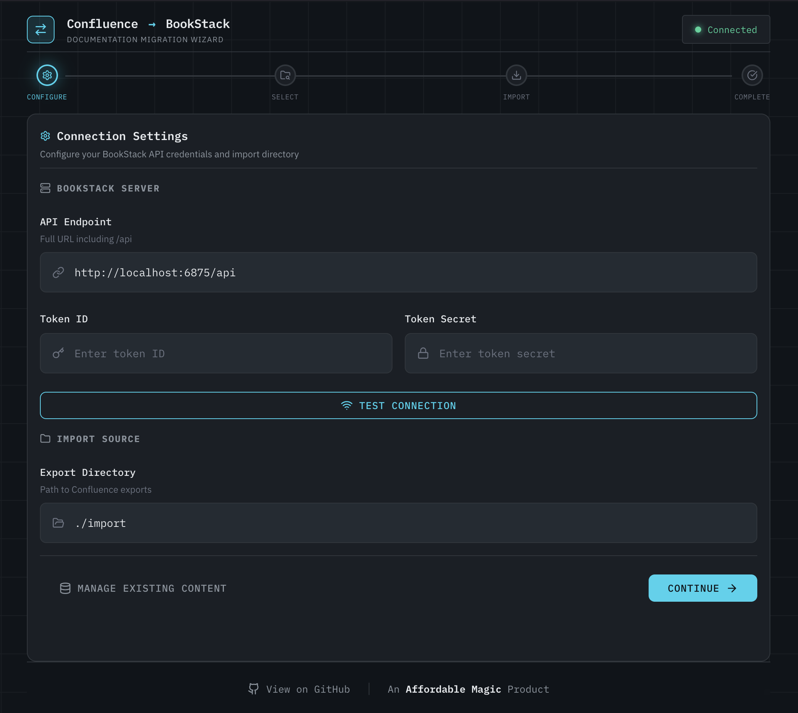
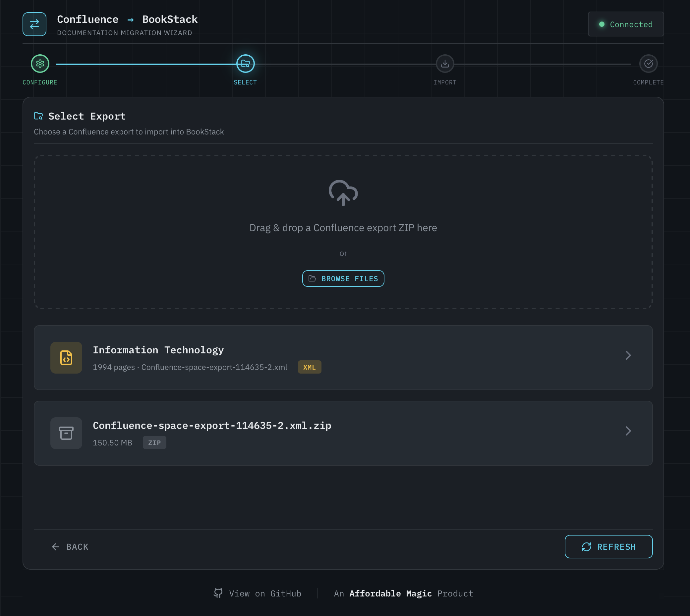
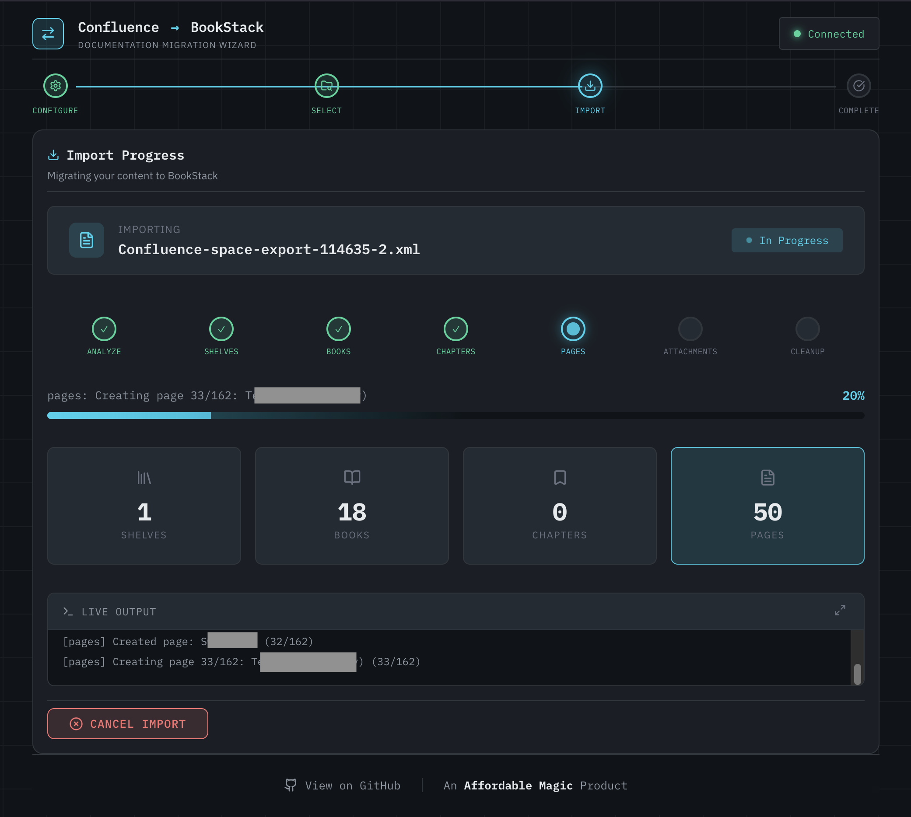
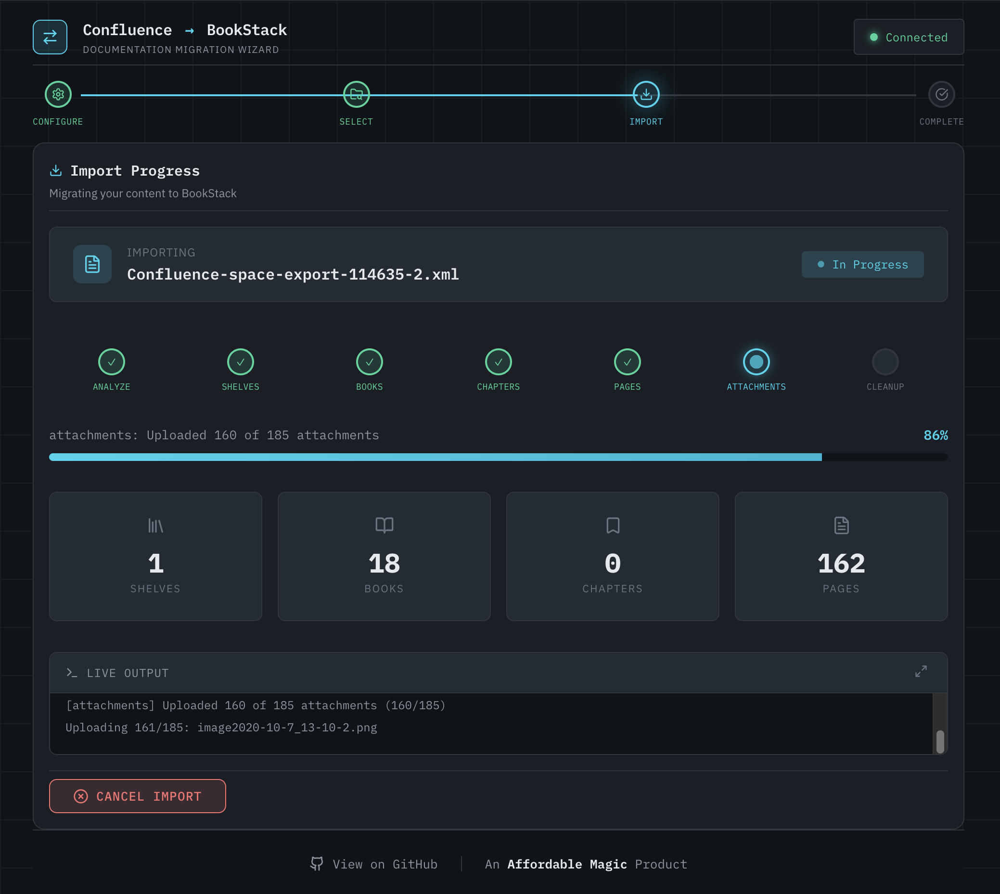
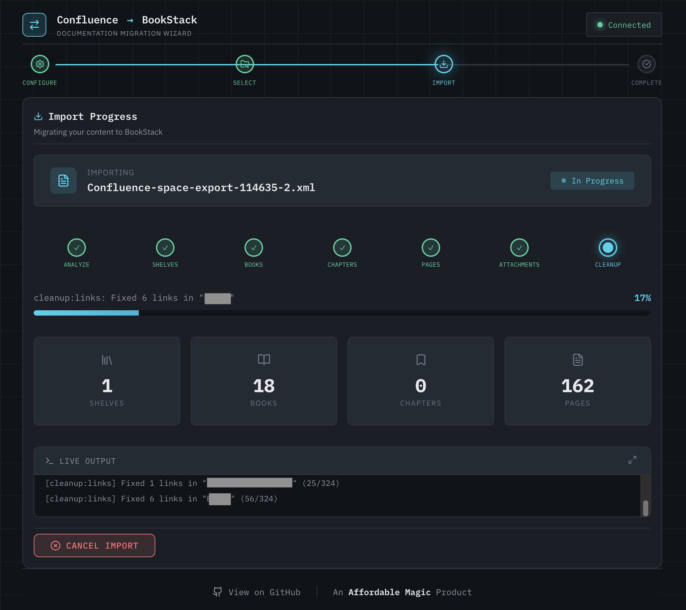

# Confluence to BookStack Wizard

An interactive wizard for migrating Confluence spaces to BookStack. Features both a modern **Web UI** and a terminal interface (TUI) with guided workflows, real-time progress tracking, and post-import cleanup tools.

## Features

- **Web Interface** - Modern browser-based wizard with drag & drop uploads
- **Terminal Interface** - Full TUI for command-line workflows
- **HTML & XML Export Support** - Works with both Confluence export formats
- **Live Progress Tracking** - Real-time counters and phase visualization
- **Drag & Drop Upload** - Upload ZIP exports directly in the browser
- **Post-Import Cleanup** - Automatic fixing of links, images, and Confluence artifacts
- **Content Management** - View and delete existing BookStack content
- **Rate Limiting** - Built-in retry logic to handle API throttling
- **Cross-Platform** - Works on macOS, Linux, and Windows

## Prerequisites

- Node.js (v16 or higher recommended)
- A BookStack instance with API access
- Confluence HTML or XML export files

## Installation

```bash
git clone https://github.com/transcriptionstream/confluence-to-bookstack-wizard.git
cd confluence-to-bookstack-wizard
npm install
```

## Usage

### Web Interface (Recommended)

Start the web-based migration wizard:

```bash
npm run web
```

Then open **http://localhost:3456** in your browser.

#### Step 1: Configure

Enter your BookStack API credentials and import path.

<p>
  
</p>

#### Step 2: Select Export

Choose a Confluence export to import. You can drag & drop ZIP files directly or browse existing exports.

<p>
  
</p>

#### Step 3: Import

Watch real-time progress as your content is imported with live counters and phase tracking.

<p>
  
  
  
</p>

#### Step 4: Complete

View your import summary and open BookStack to see your migrated content.

<p>
  
</p>

### Terminal Interface

Start the terminal wizard:

```bash
npm run setup
```

### First Run - Configuration

On first run (or if no `.env` file exists), the wizard will guide you through configuration:

<p>
  
</p>

You'll be prompted to enter:
- **BookStack URL** - Your BookStack instance URL
- **API Token ID** - Generate in BookStack under **Settings > API Tokens**
- **API Token Secret** - The secret for your API token
- **Export Path** - Path to your Confluence export files

The wizard saves these settings to a `.env` file automatically.

### Full Import Workflow (Recommended)

Select **Full Import Workflow** to run a complete migration:

<p>
  
</p>

1. Choose a Confluence export ZIP file or folder
2. Import all pages and structure
3. Upload attachments
4. Run cleanup scripts

A summary is displayed when complete showing books/pages created.

### Individual Operations

You can also run steps individually:

- **Import Space** - Import a single Confluence export
- **Upload Attachments** - Upload attachments for an already-imported space
- **Post-Import Cleanup** - Fix links, embedded images, and remove Confluence artifacts
- **Delete Shelf** - Remove a shelf and all its contents (with confirmation)

## Export Formats

Place your Confluence export ZIP files in the `import` folder within the project directory. The wizard will extract them automatically.

### XML Export (Recommended)
1. In Confluence, go to **Space Settings > Content Tools > Export**
2. Select **XML** format
3. Place the ZIP file in the `import` folder

XML exports are faster to process and require less post-import cleanup.

### HTML Export
1. In Confluence, go to **Space Settings > Content Tools > Export**
2. Select **HTML** format
3. Place the ZIP file in the `import` folder

HTML exports work but may require more post-processing to fix links and embedded content.

## How It Works

BookStack has a more rigid structure than Confluence:
- **Shelves** contain **Books**
- **Books** contain **Chapters** and/or **Pages**
- **Chapters** contain **Pages**

The wizard maps Confluence's freeform structure:
- Each Confluence **Space** becomes a **Shelf**
- Top-level pages become **Books**
- Child pages become **Chapters** or **Pages** based on nesting

Pages that would otherwise live directly on a Shelf are placed in a Book with a "_General" page.

## Post-Import Cleanup

The cleanup tools fix common issues after import:

| Tool | Purpose |
|------|---------|
| Fix Attachment Links | Updates `href` attributes to point to uploaded attachments |
| Fix Embedded Images | Converts base64 and broken image references |
| Remove Placeholders | Removes Confluence plugin placeholder images |
| Remove Thumbnails | Removes document conversion thumbnails and emoticons |

## Troubleshooting

### Rate Limiting (429 Errors)
The wizard includes automatic retry with exponential backoff. If you see frequent rate limiting, the scripts will wait and retry automatically.

## Author

Developed by [Affordable Magic](https://affordablemagic.net) | [GitHub](https://github.com/transcriptionstream)

## Credits

Built upon [confluence-server-to-bookstack-importer](https://github.com/gloverab/confluence-server-to-bookstack-importer) by [@gloverab](https://github.com/gloverab).

## License

MIT
